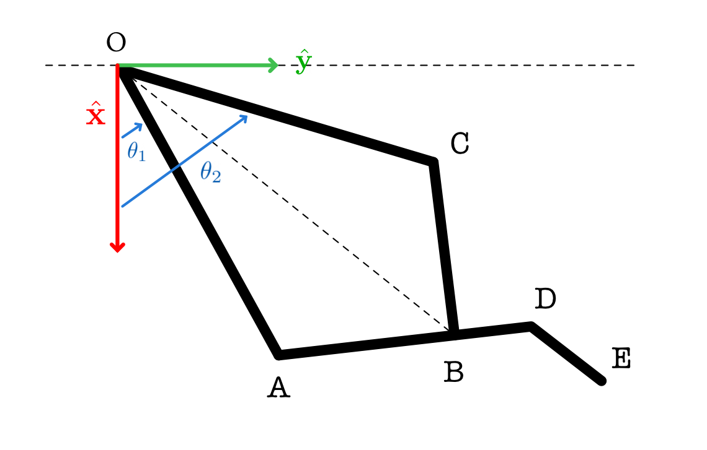

# Direct-Drive Hand

## Definitions

Each finger is made of a symmetrical five-bar linkage, as shown below.

Symmetrical meaning $AB=BC=l_1$ and $OA=OC=l_2$.

$ABDE$ is a single rigid link, where $E$ is the finger tip. $AD=l_3$, $DE=l_4$, $\angle ADE=\beta$.

we apply a change of variable to make it more intuitive and easier to control:
$$
\alpha_1 = \frac{\theta_1+\theta_2}{2}, \quad \alpha_2 = \frac{\theta_2-\theta_1}{2}
$$
