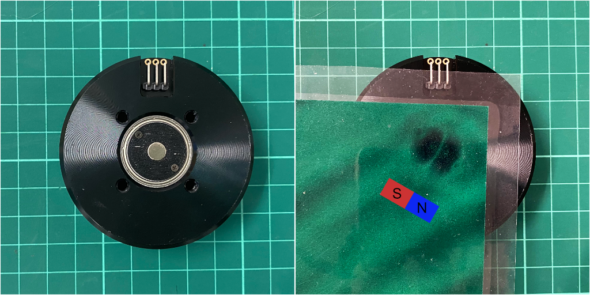

# Direct-Drive Gripper

The repo contains the hardware design and documentation of our in-house 2-finger 4-DoF direct-dirve gripper.


# Table of Contents

- [Bill of Materials (BOM)](#bill-of-materials-(BOM))
  - [Purchase](#purchase)
  - [3D Printing](#3d-printing)
- [Assembly](#assembly)
  - [Actuator ⨉4](#actuator)
  - [Finger ⨉2](#finger)
  - [Gripper](#gripper)
  - [Mounting](#mounting)
  - [Wiring](#wiring)
- [Configuration and Calibration](#configuration-and-calibration)
  - [Before Assembly](#before-assembly)
    - [Label Components](#label-components)
    - [Calibrate ODrive](#calibrate-odrive)
    - [Calibrate Motor Offset](#calibrate-motor-offset)
  - [After Assembly](#after-assembly)
    - [Calibrate Motor Direction](#calibrate-motor-direction)
    - [Calibrate Linkages](#calibrate-linkages)
    - [Configure Gripper Geometry](#configure-gripper-geometry)


# Bill of Materials (BOM)


### Purchase

- [ODrive 3.6-56V](https://odriverobotics.com/shop/odrive-v36) ⨉2
- [T-Motor GB54-2](https://store.tmotor.com/goods.php?id=445) ⨉4
- [AS5048A Encoder + Diametrical Magenet](https://item.taobao.com/item.htm?id=619004953504) ⨉4
- [Bearing - outer-diameter = 10mm, inner-diameter = 6mm](https://item.taobao.com/item.htm?id=649671875461) ⨉12
- [Dowel Pin - diameter = 6mm, length = 10mm](https://detail.tmall.com/item.htm?id=522002486638) ⨉6
- [14-Core Shielded Cable TRVVSP4](https://detail.tmall.com/item.htm?id=649477061772) ⨉2 meters
- [MX1.25-6P 150mm Cable](https://item.taobao.com/item.htm?id=607231799768) ⨉4
- [AMASS Braided 3-Phase 90cm Cable](https://item.taobao.com/item.htm?id=520248392055) ⨉8
- Mounting Couplers (*)
- Various Fasteners from M2 to M4


### 3D Printing 

- Magnet Holder ⨉4
- Motor Plate ⨉4
- Proximal Link ⨉4
- Distal Link ⨉2
- Distal Tip Link ⨉2
- Finger Tip ⨉2
- Actuator Mount ⨉1
- Coupler ⨉1


(*) Mounting Footnotes

The mounting coupler is designed to work with the mounts for Robhotiq 3f Adaptive robot gripper and Universal robhot UR10 (50mm PCD with 4 x M6). You will need to design your own coupler if you use other robot models. 


# Assembly


<a name="actuator"></a>

## Actuator ⨉4


<a name="finger"></a>

## Finger ⨉2


## Gripper


## Mounting


## Wiring


# Configuration and Calibration


## Before Assembly


### Label Components 

There are two ways to mount the gripper on the robot arm. They are equivalent as long as you keep it consistent.


### Calibrate ODrive


### Calibrate Motor Offset 

The following values in the configuration will be calibrated in this step

- `/motors/R0/offset`
- `/motors/R1/offset`
- `/motors/L0/offset`
- `/motors/L1/offset`


`AS5048A` encoder used in this gripper is a Hall effect magnetic encoder. It is used together with a diametrically magnatized magnet. This magnet has a intrinsic direction not visiable to the naked eye, but can be seen through a [magnetic field viewing film](https://en.wikipedia.org/wiki/Magnetic_field_viewing_film), as shown below. This step will calibrate the direction of the magnet relative to the rotor.





## After Assembly


### Calibrate Motor Direction

The following values in the configuration will be calibrated in this step

- `/motors/R0/dir`
- `/motors/R1/dir`
- `/motors/L0/dir`
- `/motors/L1/dir`


### Calibrate Linkages

The following values in the configuration will be calibrated in this step

- `/linkages/R0`
- `/linkages/R1`
- `/linkages/L0`
- `/linkages/L1`

```yaml
linkages:
  R0: -45
  R1: 45
  L0: 45
  L1: -45
```


### Configure Gripper Geometry


```yaml
geometry:
  l1: 50 # length of proximal links
  l2: 35 # length of distal links
  beta: 150 # angle from l2 to finger surface 
  l3: 80.04 # distance from distal joint to fingertip
  gamma: 160.66 # angle from l2 to fingertip
  # r: distance of distal joint to motor
  r_min_offset: 0 # r_min = sqrt(l1**2 - l2**2) + r_min_offset
  r_max_offset: 1 # r_max = l1 + l2 - r_max_offset
```

